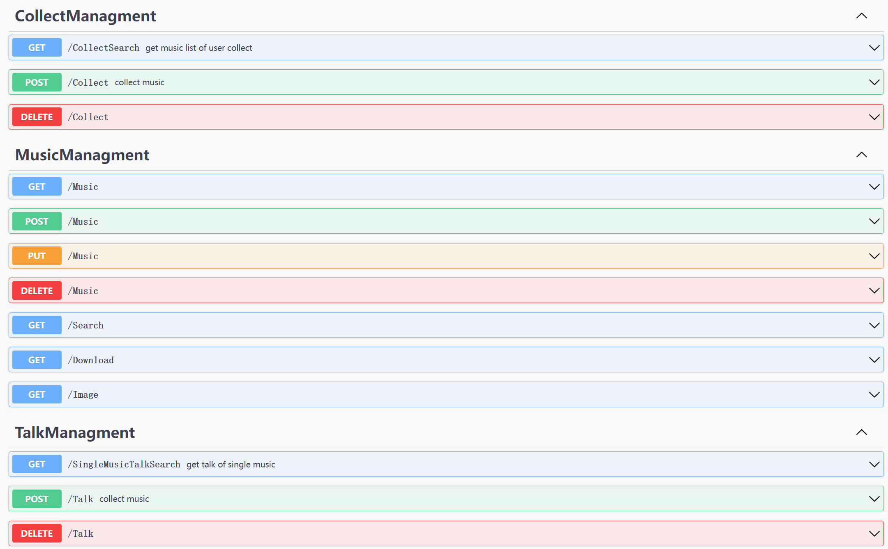

# MusicManagementsMinimalAPI

这是一个简单的音乐管理器的服务器后端程序，使用 **.NET6** 的 **Minimal APIs** 进行开发，数据库为SQL Server。该程序提供了一组API接口可供前端程序调用（既包括web前端如VUE3或桌面前端如**Avalonia**编写的桌面前端），并且为了方便使用者查看接口功能启用了Swagger组件。

与音乐管理器配套的Avalonia前端程序同样可从本人的其他仓库中得到。



---

### 所需依赖

后端程序所需依赖

后端程序虽然仅主要使用了 **Minimal APIs**的库，但运行环境为 **.NET8**，其余操作数据库和使用 **Swagger**的所需依赖列表如下,均可使用NuGet进行安装。

```
Microsoft.AspNetCore.Diagnostics.EntityFrameworkCore  8.0.2
Microsoft.EntityFrameworkCore.SqlServer  8.0.2
Microsoft.EntityFrameworkCore.Tools  8.0.2
Microsoft.AspNetCore.OpenApi  8.0.2
Swashbuckle.AspNetCore  6.5.0
```

数据库所需依赖

```
SQL Server 2022
```


### 运行

1 使用SQL Server客户端（SSMS）新建一个数据库并将sql文件夹里的sql脚本导入。然后将项目目录下的 **appsettings.Development.json**文件中的数据库 **ConnectionStrings**字段修改为自己的数据库的服务器名称、用户名和密码等信息。

2 在Visual Studio中运行项目。

3 项目运行后可在浏览器中的Swagger页面查看项目功能对应的API接口。

---

### 项目目录

项目目录所涉及的主要文件夹和文件结构

MusicManagementsMinimalAPI


|——Assert    *资源文件夹*

|——Common   *公共类文件夹*

- |——Config   *文件夹主要包含了需要注入的DbContext*

|——Customer   *自定义类文件夹*

|——Data      *数据模型文件夹*

|——Models    *实体类文件夹*

- |——DTO    *接口返回所需的包装类文件夹*

|——Route    *路由文件夹，充当controller的功能*

|——appsettings.json    *配置数据库连接*

|——Program.cs          *服务器启动主程序*


